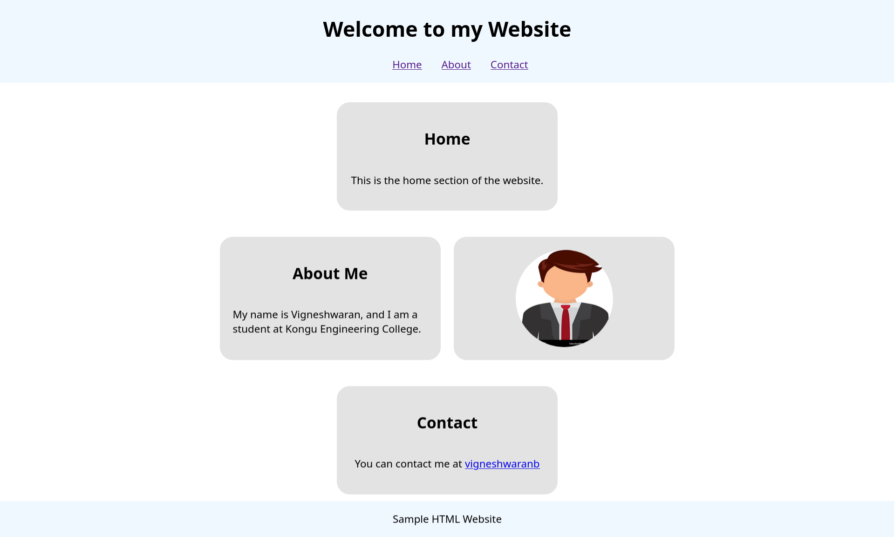

# Static Website
This project is a simple static HTML webpage that includes a navigation menu, three sections (Home, About, Contact), and a footer. The page is styled using CSS and follows a responsive design approach.

## HTML Tags Used
- `<header>`: Defines the website's header, including the title and introduction.
- `<nav>`: Contains navigation links to different sections of the page.
- `<main>`: Wraps the main content of the website.
- `<section>`: Groups related content (Home, About, Contact).
- `<footer>`: Displays information at the bottom.

---

## CSS Used
- **Typography**: Sets font styles, sizes, and colors for better readability.
- **Layout**: Uses `margin`, `padding`, and `max-width` for spacing and alignment.
- **Navigation Styling**: Styles navigation links.
- **Responsive Design**: Uses `@media` queries to adjust the layout for smaller screens.

---

## Desktop Preview

---

## Mobile Preview

